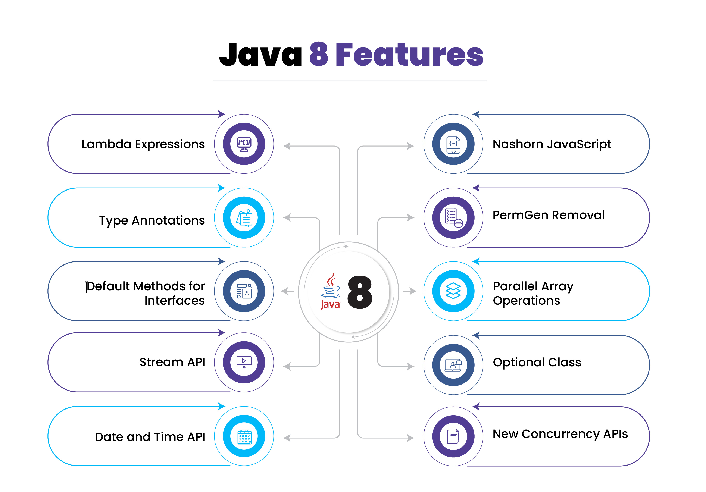

# Java 8 Features

Java 8 introduced several major enhancements to the Java programming language, focusing on functional programming, improved API usability, and performance optimizations.



## Key Features Introduced in Java 8

### 1. **Lambda Expressions**

Lambda expressions enable functional programming by allowing you to write cleaner and more concise code. A lambda is a syntactic shorthand for implementing a functional interface.

* Treat functions as values
* Write shorter, cleaner code
* Avoid boilerplate (especially anonymous classes)
* Work easily with Streams API
* Pass behavior as an argument

Before Java 8:
```java
Runnable r = new Runnable() {
    @Override
    public void run() {
        System.out.println("Running");
    }
};
```
📌With Lambda:

```java
Runnable r = () -> System.out.println("Running");
```


### 2. **Functional Interfaces**

Interfaces with **exactly one abstract method**. This single abstract method represents a function (a behavior), which can be supplied using:

* Lambda Expressions
* Method References
* Anonymous Classes

Functional Interfaces enable functional programming. Without functional interfaces → lambdas would not work. 

🧠Key rules:
* Must have exactly one abstract method
* Can have any number of default methods
* Can have any number of static methods
* **Can override methods from Object** (not counted as abstract method)

**📌 Examples of Functional Interfaces**

Built-in Java functional interfaces include:

* Runnable → run()
* Callable → call()
* Comparator → compare()
* Function<T,R> → apply()
* Predicate<T> → test()
* Consumer<T> → accept()
* Supplier<T> → get()

User defined:

```java
@FunctionalInterface
interface Calculator {
    int add(int a, int b);

    default void show() {
        System.out.println("Calculator");
    }

    static void info() {
        System.out.println("Static Method");
    }
}
```

Using a lambda with it:

```java
Calculator c = (a, b) -> a + b;
System.out.println(c.add(5, 3)); // 8
```

🎯Overriding methods from Object (does not count)

```java
@FunctionalInterface
interface Vehicle {
    void drive();

    String toString();   // OK, not counted
}
```


### 3. **Streams API**

Streams API provides a functional, declarative way to process collections, arrays, and I/O data.

**📌 What is a Stream?**

A Stream is a sequence of data elements supporting sequential and parallel operations.

* Not a data structure
* Does **not** store elements
* Does **not** modify the underlying collection
* Operations can be lazy, pipelined, and parallelizable

Analogy: Think of a stream as a conveyor belt on which elements flow and operations process them.

**📌 Stream Pipeline**

A pipeline consists of three parts: Source, Intermediate Operations, and Terminal Operation.

1. Source:
```java
// Source
List<Integer> list = Arrays.asList(1, 2, 3);
Stream<Integer> stream = list.stream();
```

2. Intermediate Operations (return a stream):

* Lazy evaluation
* Don't execute until a terminal operation is called
* Examples: map(), filter(), sorted(), distinct(), limit(), skip()

3. Terminal Operations (produce a result):

* Triggers execution
* Returns non-stream value
* Examples: collect(), forEach(), reduce(), count(), findFirst(), findAny()


**Example:**

```java
List<String> result = list.stream()
                         .filter(s -> s.startsWith("A"))
                         .collect(Collectors.toList());

// Sorting employees by salary
employees.stream()
        .sorted(Comparator.comparing(Employee::getSalary))
        .toList();

// Paginating a list
List<Integer> page2 = nums.stream()
        .skip(5)
        .limit(5)
        .toList();

// Creating a Map from a List
Map<String, Integer> map = employees.stream()
        .collect(Collectors.toMap(
                Employee::getName,
                Employee::getSalary
        ));

// Reducing to a single value
int sum = nums.stream()
        .reduce(0, (a, b) -> a + b);

// Finding the top 3 highest paid employees
List<Employee> top3 = employees.stream()
        .sorted(Comparator.comparing(Employee::getSalary).reversed())
        .limit(3)
        .toList();

// Counting employees in each department
Map<String, Long> count =
        employees.stream().collect(
                Collectors.groupingBy(Employee::getDepartment, Collectors.counting())
        );

// Parsing CSV string to List
String csv = "apple, banana, cherry, date";
List<String> list = Arrays.stream(csv.split(","))
        .map(String::trim)
        .toList();

// Sum of squares of even numbers
int result = nums.stream()
        .filter(n -> n % 2 == 0)
        .map(n -> n * n)
        .reduce(0, Integer::sum);
```


### 4. **Default Methods in Interfaces**

Interfaces can now have **default** method implementations.

#### 📌Why Default Methods Were Introduced

**Before Java 8:**

* Interfaces could only contain abstract methods.
* If you added a new abstract method to an interface used by hundreds of classes, all implementations would break.

**➡️ Default methods solve this problem**

They allow you to extend interfaces without forcing all implementors to change.

```java
interface Vehicle {
    void start();

    default void honk() {
        System.out.println("Beep!");
    }
}
```


#### ❗ The Diamond Problem in Interfaces**

If a class implements multiple interfaces with same default method signature, you get a conflict.

```java
interface A {
    default void hello() { System.out.println("A"); }
}

interface B {
    default void hello() { System.out.println("B"); }
}

class C implements A, B {
    // Compilation error unless overridden
}

// Fix by overriding:
class C implements A, B {
    @Override
    public void hello() {
        A.super.hello(); // or B.super.hello()
    }
}
```


#### 📌Default Method Resolution Rules (VERY IMPORTANT)

Resolution Priority:

1️⃣ **Class methods win over default methods**
If a superclass defines a method, default methods are ignored.

2️⃣ **More specific interface wins**
If interface B extends A and both define default methods, B's version wins.

3️⃣ **If still ambiguous → compile-time error → developer must override**


#### 📌Performance Aspects of Default Methods

Default methods are invoked via **invokeinterface** – same as other interface methods.

Performance is slightly slower than direct class method calls, but negligible for real-world use.


#### 📌When to Use Default Methods

* ✔ Adding new methods to existing interfaces safely
* ✔ Providing optional, common behavior
* ✔ Improving readability (e.g., Collections API)
* ✔ Evolving API without breaking clients


#### 📌When NOT to Use Default Methods

* ❌ When behavior should be enforced (use abstract methods instead)
* ❌ When it leads to ambiguity/conflicts
* ❌ When it violates interface segregation principle (keep interfaces focused)
* ❌ When method requires state
* ❌ Over-using them may lead to complicated inheritance graphs


#### 📌**Can Default Methods Override Object Class Methods?**

No. Default methods cannot override:

* toString()
* equals()
* hashCode()

```java
java: default method toString in interface A overrides a member of java.lang.Object
```

**Why?**
Because Object methods have the highest priority in method resolution.


#### 📌Summary

| Topic                                | Key Point                                             |
| ------------------------------------ | ----------------------------------------------------- |
| Why introduced?                      | To evolve interfaces without breaking implementations |
| Diamond problem?                     | Must override when conflict occurs                    |
| Resolution order                     | Class → more specific interface → else compile error  |
| Override Object methods?             | Not allowed                                           |
| Can have static and private methods? | Yes                                                   |
| Good for?                            | Optional methods and backwards compatibility          |
| Avoid when?                          | Method uses state or creates complex hierarchies      |


### 5. **Method References**

A shorthand syntax for writing lambda expressions. It is a compact way of saying:
“Use this method as a lambda”

Example:
```java
list.forEach(System.out::println);
```

is equivalent to:
```java
list.forEach(x -> System.out.println(x));
```
Both pass a Consumer<T> that prints each element.


#### 📌Types of Method References
Java defines exactly four method reference forms.

**1️⃣ Reference to a Static Method**

```java
// Syntax: ClassName::staticMethod
Function<String, Integer> toInteger = Integer::parseInt;
// Equivalent to:
s -> Integer.parseInt(s);
```

**2️⃣ Reference to an Instance Method of a Particular Object**

```java
// Syntax: instance::instanceMethod
String prefix = "Hello, ";
Function<String, String> concat = prefix::concat;
// Equivalent to:
s -> prefix.concat(s);
```

**3️⃣ Reference to an Instance Method of an Arbitrary Object of a Given Type**

This one is confusing but extremely powerful. Java will treat the first argument of the functional interface as the target object.
> “Call the instance method on the _first parameter_ of the functional interface.”
> * The **actual object** on which the method is invoked is supplied **at runtime**
> * The method reference itself does not specify which object
> * Instead, the functional interface binds the first parameter as the object

```java
// Syntax: ClassName::instanceMethod
Function<String, Integer> stringLength = String::length;
// Equivalent to:
s -> s.length();

List<String> list = Arrays.asList("a", "bb", "ccc");
list.sort(String::compareToIgnoreCase);
// Equivalent to:
list.sort((s1, s2) -> s1.compareToIgnoreCase(s2));

BiPredicate<String, String> startsWith = String::startsWith;
// Equivalent to:
(s, prefix) -> s.startsWith(prefix);

BiFunction<String, String, Boolean> contains = String::contains;
// Equivalent to:
(s, substr) -> s.contains(substr);

Map<String, Integer> map = Map.of("a", 1, "bbb", 3);
map.keySet().stream().max(String::compareTo);
// Equivalent to:
map.keySet().stream().max((s1, s2) -> s1.compareTo(s2));

Arrays.sort(arr, String::compareToIgnoreCase);
// Equivalent to:
Arrays.sort(arr, (s1, s2) -> s1.compareToIgnoreCase(s2));
```

**4️⃣ Reference to a Constructor**

```java
// Syntax: ClassName::new
Supplier<List<String>> listSupplier = ArrayList::new;
// Equivalent to:
() -> new ArrayList<>();

// parameterized construction
Function<Integer, int[]> arrayMaker = int[]::new;
// Equivalent to:
size -> new int[size];
```


#### 📌How Method References Are Mapped to Functional Interfaces

A method reference must match a functional interface’s:

* method signature (parameters)
* return type

Example:

```java
Function<String, Integer> f = Integer::valueOf;
```

Internally matches:

```java
Integer valueOf(String input);
```

If mismatch → compile error.


#### ⭐ Internals: How JVM interprets this

When you write: `String::trim`

JVM interprets it as:

1. A lambda factory is generated using `invokedynamic` 
2. That factory binds the method reference to a functional interface 
3. The functional interface’s **first argument** is assigned as the “receiver”
4. A call is made as if: `receiver.trim()`


#### 📌Common Pitfalls & Edge Cases

**❌ Ambiguous method references**

```java
class Example {
    public static void print(Integer i) { System.out.println("Integer: " + i); }
    public static void print(String s) { System.out.println("String: " + s); }

    public static void main(String[] args) {
        // ❌ Ambiguous - compiler error
        // Consumer<Object> c = Example::print;

        // Resolved by casting
        Consumer<Integer> c1 = Example::print;
        Consumer<String> c2 = Example::print;
    }
}
```

**❌ Null references when using instance method references**

```java
String str = null;
Function<String, Integer> func = str::length; // NullPointerException at runtime
```

**❌ Cannot reference methods with incompatible signatures**

**❌ Cannot reference a private method of another class**


#### 📌Best Practices

* ✔ Use method references only when they improve readability
* ✔ Prefer static method references for utility functions
* ✔ Use constructor references in Streams (factory pattern)
* ✔ Use `Class::instanceMethod` for comparators and common ops
* ✔ Avoid when additional logic needed → use lambda instead


#### 📌Summary

| Form                                | Syntax                | Means                               |
| ----------------------------------- | --------------------- | ----------------------------------- |
| Static method                       | `Class::staticMethod` | `x -> Class.staticMethod(x)`        |
| Instance of specific object         | `obj::method`         | `x -> obj.method(x)`                |
| Instance method of arbitrary object | `Class::method`       | `(obj, arg..) -> obj.method(arg..)` |
| Constructor                         | `Class::new`          | `args -> new Class(args)`           |


> **Difference between `obj::method` and `Class::method`?**
> * obj::method → bound to instance
> * Class::method → first argument becomes target


### 6. **Optional Class**

A container object to avoid `NullPointerException`.

```java
Optional<String> name = Optional.of("John");
name.ifPresent(System.out::println);
```

### 7. **New Date & Time API (java.time)**

A modern, improved date/time API inspired by Joda-Time.

```java
LocalDate today = LocalDate.now();
LocalDate nextWeek = today.plusWeeks(1);
```

### 8. **Nashorn JavaScript Engine**

A lightweight JavaScript engine built into the JDK (later removed in newer versions).

### 9. **Parallel Streams**

Allows parallel execution of stream operations.

```java
list.parallelStream().forEach(System.out::println);
```

### 10. **Collectors API Enhancements**

Powerful utilities for collection transformations.

```java
Map<String, Long> countByName = list.stream()
    .collect(Collectors.groupingBy(Function.identity(), Collectors.counting()));
```

### 11. **Completable Future**

A powerful API for asynchronous programming.

```java
CompletableFuture.supplyAsync(() -> "Hello")
    .thenApply(String::toUpperCase)
    .thenAccept(System.out::println);
```

### 12. **Static Method in Interfaces**

Interfaces can now have static methods.

```java
interface Utility {
    static void print(String message) {
        System.out.println(message);
    }
}
```

### 13. **Type Annotations**

Allows annotations to be applied to any use of a type.

```java
@NonNull String name;
```

### 14. **PermGen Removal**

The permanent generation (PermGen) space was removed and replaced with Metaspace, which is native memory and can grow dynamically.


### 15. **Parallel Array Operations**

```java
Arrays.parallelSort(array);
```


---

## Java 7 vs Java 8 Comparison

| Feature           | Java 7                              | Java 8                       |
| ----------------- | ----------------------------------- | ---------------------------- |
| Programming Style | Imperative                          | Functional + Imperative      |
| Lambda Support    | ❌ No                                | ✅ Yes                        |
| Stream API        | ❌ No                                | ✅ Yes                        |
| Date/Time API     | Old `java.util.Date` and `Calendar` | Modern `java.time` package   |
| Default Methods   | ❌ No                                | ✅ Yes                        |
| Method References | ❌ No                                | ✅ Yes                        |
| Optional Class    | ❌ No                                | ✅ Yes                        |
| Performance       | Good                                | Better with parallel streams |
| Nashorn JS Engine | ❌ No                                | ✅ Yes                        |

### Summary

Java 7 focused on stability and small improvements, while Java 8 brought a major paradigm shift by introducing functional programming, simplifying collections, and modernizing the API ecosystem.

---

## Java 8 Interview Questions

### 1. What are lambda expressions and why were they introduced?

Lambda expressions enable functional programming and help write cleaner, more concise code, especially for callbacks and collection operations.

### 2. What is the difference between a lambda expression and an anonymous class?

* Lambdas are lighter, faster, and focus on behavior.
* Anonymous classes create separate class files and are more verbose.

### 3. What is a functional interface? Give examples.

An interface with exactly one abstract method. Examples: `Runnable`, `Callable`, `Supplier`, `Function`.

### 4. What are streams in Java 8?

A pipeline-based API for processing data in a declarative way. Supports operations like map, filter, reduce.

### 5. Difference between intermediate and terminal stream operations?

* Intermediate: return a new stream (lazy). Example: `filter()`, `map()`
* Terminal: produce a result. Example: `collect()`, `count()`

### 6. What is Optional and why is it used?

A container object to prevent NullPointerException and encourage explicit null handling.

### 7. What are default methods in interfaces?

Methods with implementation inside interfaces. Allow backward compatibility.

### 8. What are method references?

Shortcuts to lambda expressions using `::`. Example: `System.out::println`.

### 9. What is the difference between Collection.stream() and Collection.parallelStream()?

* `stream()`: sequential execution
* `parallelStream()`: parallel execution using ForkJoinPool

### 10. Explain map() vs flatMap().

* `map()`: transforms each element
* `flatMap()`: flattens nested structures and then transforms

---

## Why Java 8 Was a Big Deal

* Introduced functional programming to Java
* Simplified collection processing
* Eliminated many common bugs (like null pointer issues)
* Improved performance with parallelism
* Standardized date & time handling

